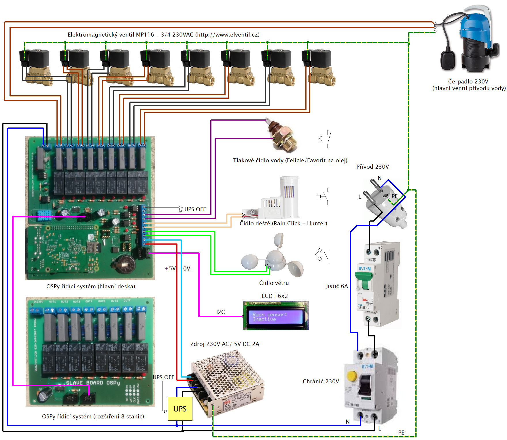

OSPy Readme
====

OSPy - OpenSprinklerPython An improved Python port of the Arduino based OpenSprinkler firmware.

This is my fork from Rimco/OSPy (https://github.com/Rimco/OSPy) with My modifications.  

## More information visit
Martin Pihrt - pihrt.com: https://pihrt.com/elektronika/248-moje-rapsberry-pi-zavlazovani-zahrady

## Hardware

INSTALLATION:
===========

### Preferred option (using Git)
(This option does support automatic updating.)

1. Ensure git is installed (and the git executable is in your path).
2. Use git to clone: git clone -b master https://github.com/martinpihrt/OSPy.
3. Next use step "Setup"

### Manual OSPy-system update (using Git, without system update plugin if plugin not work)
1. Go to the folder where the run.py file is located (cd OSPy).
2. Execute: sudo git config core.filemode false
3. Execute: sudo git reset --hard
4. Execute: sudo git pull

### Second option (without Git)
(This option does *not* support automatic updating.)

1. Download a copy of the program from https://github.com/martinpihrt/OSPy/archive/master.zip.
2. Extract the contents to a location of your choice.

## Setup
A setup file has been provided to help you setting up your environment to contain all required packages.
This setup also helps you in case you want to run the program as a service (on Raspbian).

1. Go to the folder where the setup.py file is located (cd OSPy).
2. Execute: sudo apt-get update and follow the procedures
3. Execute: sudo apt-get upgrade and follow the procedures
4. Execute: python setup.py install
5. Follow the procedures of the script.

## For enable SSL access in options (for HTTPS connections)
1. Execute: sudo apt-get install openssl
2. Execute: sudo openssl version
3. Execute: sudo cd OSPy/ssl
4. Execute: sudo openssl genrsa -des3 -out server.key 1024
5. Execute: sudo openssl req -new -key server.key -out server.csr
6. Execute: sudo openssl x509 -req -days 365123 -in server.csr -signkey server.key -out server.crt
7. Execute: sudo openssl rsa -in server.key -out server.key

## For enable I2C device (LCD plugin and more I2C plugins)  
1. Execute: sudo nano /etc/modules
2. Add in to the file:  
i2c-bcm2708  
i2c-dev  
3. Execute: sudo nano /etc/modprobe.d/raspi-blacklist.conf  
4. Change to:  
#blacklist spi-bcm2708  
#blacklist i2c-bcm2708  
5. Execute: sudo apt-get install python-SMBus  
6. Execute: sudo apt-get install i2c-tools  
7. Reboot OS system: sudo reboot
8. Try find I2C devices: sudo i2cdetect -y 1 (for RPi-1 HW sudo i2cdetect -y 0)
 
## For translate OSPy to other language
The OSPy system is currently in two languages: English and Czech. For other languages: https://github.com/martinpihrt/OSPy/tree/master/i18n and step by step, how to use is typed in MD file

## For OSPy and plugins (ospy-plugins) Changelog      
https://github.com/martinpihrt/OSPy/blob/master/ospy/docs/Changelog.md

## For OSPy and plugins Issues
https://github.com/martinpihrt/OSPy/issues

## License
OpenSprinkler Py (OSPy) Interval Program

Creative Commons Attribution-ShareAlike 3.0 license

## Acknowledgements
Full credit goes to Dan for his generous contributions in porting the microcontroller firmware to Python.

The program makes use of web.py (http://webpy.org) for the web interface.

The program makes use of gfm (https://github.com/dart-lang/py-gfm) to render the help pages written in GitHub flavored markdown.

The program makes use of pygments (http://pygments.org) to provide syntax highlighting in the help pages.

The program makes use of OpenStreetMap (https://www.openstreetmap.org) to convert locations into coordinates.

The program makes use of Dark Sky API ([Powered by Dark Sky](https://darksky.net/poweredby/)) for weather information.

